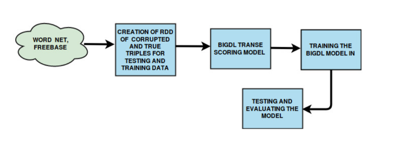

# Translating Embedding for Modelling Multi-Relational Data

## Requirements
[Python 3.6](https://www.python.org/downloads/)

[Pyspark 2.2.3](https://pypi.org/project/pyspark/)

[BigDl 0.7](https://pypi.org/project/BigDL/)

## To run the code
   1. Set the file paths for entity2id, relation2id, train and test data files and also to save/load the model.
   2. Run TransE file with python3.

